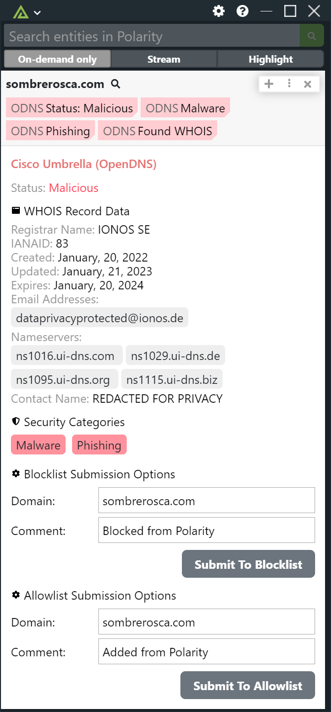
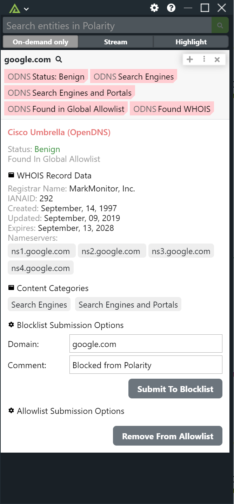

# Polarity Cisco Umbrella (OpenDNS) Integration

Provides categorization information for domains. Will report whether a domain is uncategorized, malicious or benign and includes content and security category details.

|  |  |
|--------------------------------|-----------------------------|
| _Malicious Domain_             | _Benign Domain_             |

## Options
### Cisco Umbrella API Key
Valid Cisco Umbrella API Key

> For information on generating the API Key and Secret Key please see https://developer.cisco.com/docs/cloud-security/#!authentication

### Cisco Umbrella Secret Key
Valid Cisco Umbrella Secret Key

### Return Statuses
Select one of more statuses that will be returned. The default is to only return all available domains.

Valid values are: `Malicious`, `Benign`, and `Uncategorized`

### Blocklist Destination Name
The Destination List name for the Blocklist that will be used to both Search and Submit domains. Can be found under Policies -> Policy Components -> Destination Lists. Must be set to \"Users can view only\".

### Allowlist Destination Name
The Destination List name for the Allowlist that will be used to both Search and Submit domains. Can be found under Policies -> Policy Components -> Destination Lists. Must be set to \"Users can view only\".

### Get WHOIS Data

If checked, each domain will get the WHOIS information for domains that have your selected Return Statuses.

> Must be set to "Users can view only".

### Allow Blocklist Submission

Allows you to submit a domain to be blocklisted on Cisco Umbrella.

> Must be set to "Users can view only".

### Allow Allowlist Submission

Allows you to submit a domain to be allowlisted on Cisco Umbrella.

> Must be set to "Users can view only".

## Installation Instructions

Installation instructions for integrations are provided on the [PolarityIO GitHub Page](https://polarityio.github.io/).

## Polarity

Polarity is a memory-augmentation platform that improves and accelerates analyst decision making. For more information about the Polarity platform please see:

https://polarity.io/
