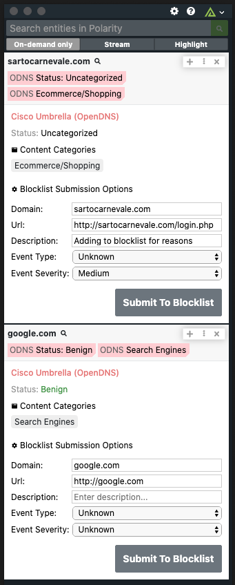

# Polarity Cisco Umbrella (OpenDNS) Integration

Provides categorization information for domains. Will report whether a domain is uncategorized, malicious or benign and includes content and security category details.

|  |
| ---------------------------- |
| _Cisco Umbrella_             |

## Options

### Cisco Umbrella Investigate API URL

The URL of the Cisco Umbrella Investigate API including the schema (i.e., https://)

Defaults to `https://investigate.api.umbrella.com`

### API Key

Valid Cisco Umbrella API Key

### Secret Key

Valid Cisco Umbrella Secret Key

## Investigate URL

The URL of the Cisco Umbrella Investigate API including the schema (i.e., https://)

## Investigate API Key

The API Key for the CISCO Umbrella Investigate API (i.e., https://)

## Umbrella Admin API URL

The URL of the Cisco Umbrella Management API including the schema (i.e., https://)

### Return Statuses

Select one of more statuses that will be returned. The default is to only return domains that have a status of "malicious".

Valid values are: `Malicious`, `Benign`, and `Uncategorized`

### Get WHOIS Data

If checked, each domain will get the WHOIS information for domains that have your selected Return Statuses.

### Allow Blocklist Submission

Allows you to submit a domain to be blocklisted on Cisco Umbrella.

### Allow Allowlist Submission

Allows you to submit a domain to be allowlisted on Cisco Umbrella.

## Installation Instructions

Installation instructions for integrations are provided on the [PolarityIO GitHub Page](https://polarityio.github.io/).

## Polarity

Polarity is a memory-augmentation platform that improves and accelerates analyst decision making. For more information about the Polarity platform please see:

https://polarity.io/
